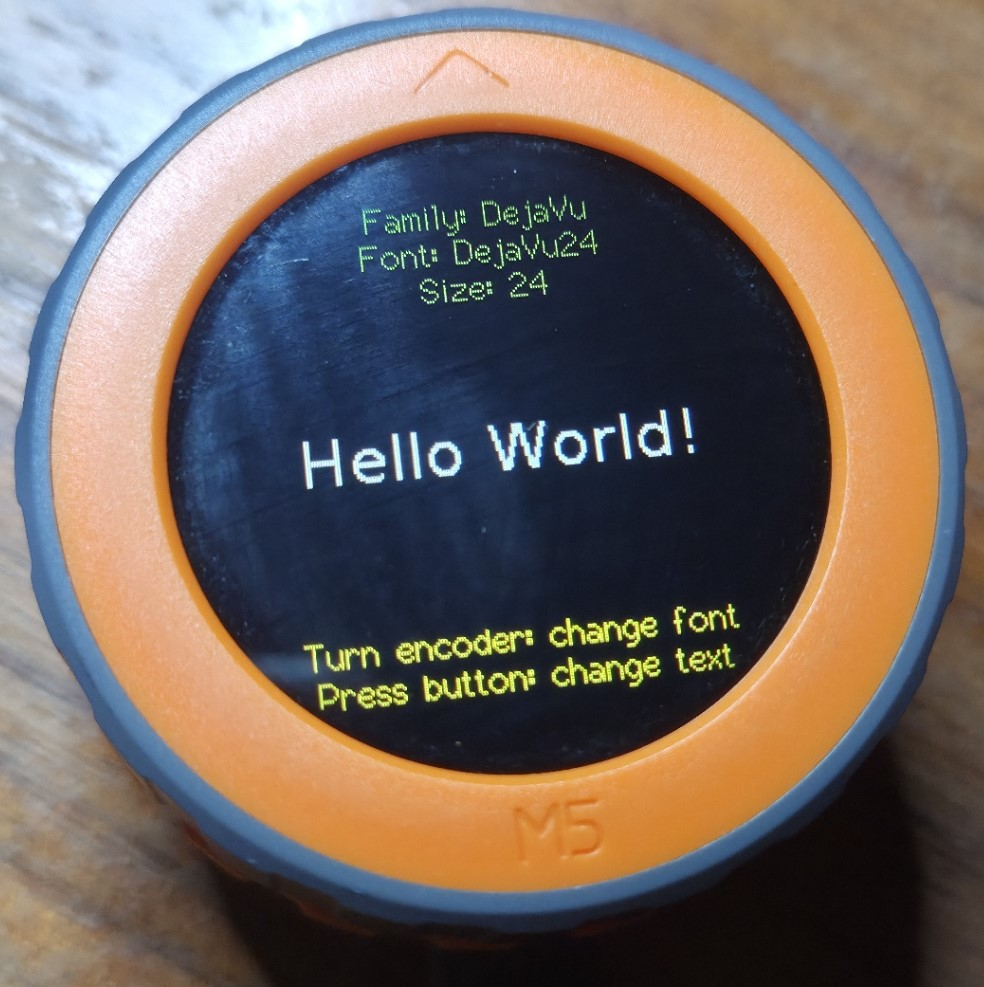
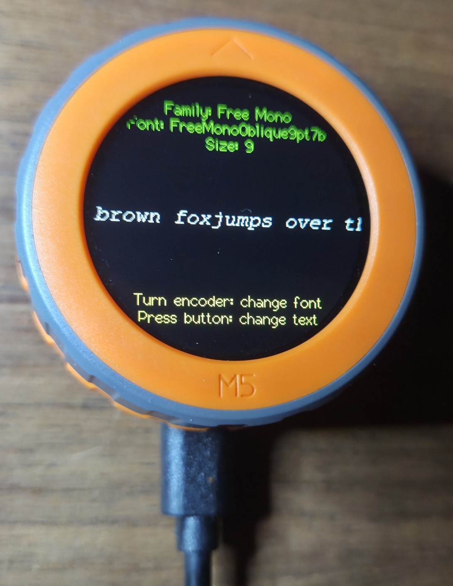
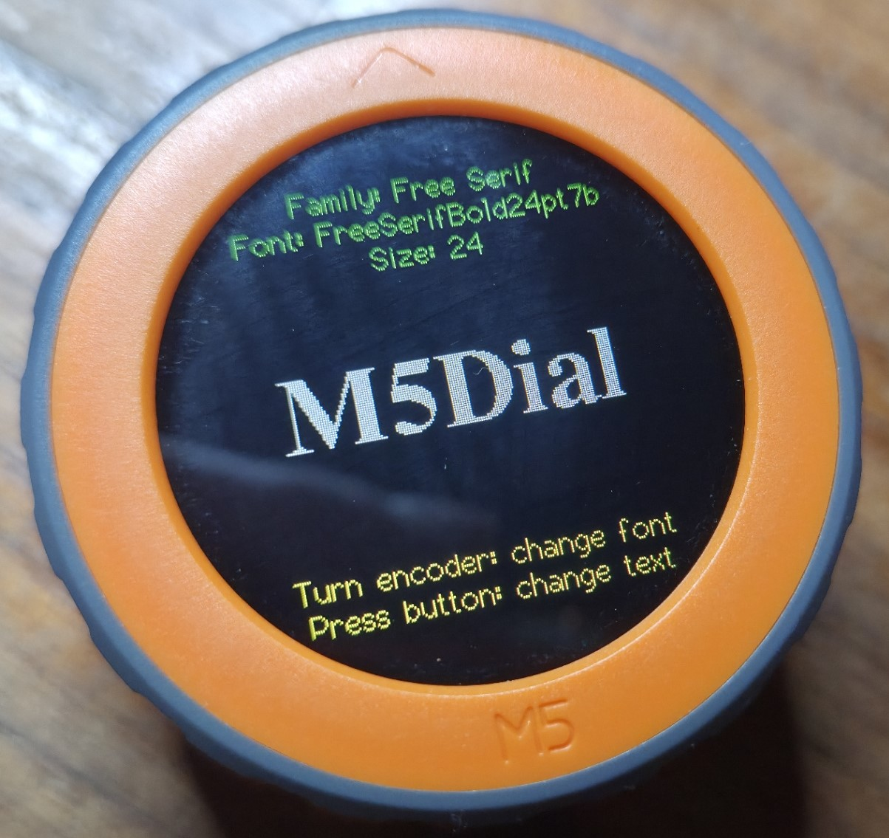

# LovyanGFX Font Display

An open source, free program to display all LovyanGFX fonts on M5 Stack devices.



## 📖 Description

This Arduino project displays over 100 different font variants across 12
families available in the LovyanGFX library
(<https://github.com/lovyan03/LovyanGFX>) for device display using LCD, OLED, or
EPD.

LovyanGFX apparently is similar to the Light and Versatile Graphics Library
(LVGL) at <https://lvgl.io/>, but with somewhat reduced functionality and an
easier learning curve.

Currently this application is bound to the M5Dial, but is structured to allow
display on other M5Stack devices in the future.

When powered on, users on an M5Dial can:

- Rotate the encoder to display sample text using different font families and
  the families various individual fonts that vary in size and style (italic &
  bold),
- Press the bottom M5 button to cycle through some dozen sample text strings,
  including [seven Panagrams](https://en.wikipedia.org/wiki/Pangram), phrases
  that use all the letters of the alphabet:

      - Pack my box with five dozen liquor jugs
      - The quick brown fox jumps over the lazy dog
      - Glib jocks quiz nymph to vex dwarf
      - Sphinx of black quartz, judge my vow
      - How vexingly quick daft zebras jump!
      - The five boxing wizards jump quickly
      - Jackdaws love my big sphinx of quartz.



## Source code repository

<https://github.com/VashJuan/LovyanGFX_font_display>

## ✨ Features

- **Font Family Navigation**: Cycle through multiple font families including:

  **Default English-Only Build** (7 font families):

  - Built-in LGFX fonts
  - Free Mono family
  - Free Sans family
  - Free Serif family
  - Decorative fonts (Orbitron, Roboto, Satisfy, Yellowtail)
  - DejaVu family

  **Full Build** (11 font families - requires external flash):

  - All English fonts (above)
  - Japanese Mincho family ⚠️ (excluded in default build)
  - Japanese Gothic family ⚠️ (excluded in default build)
  - eFontCN family (Chinese) ⚠️ (excluded in default build)
  - eFontJA family (Japanese) ⚠️ (excluded in default build)

- **Interactive Controls**:

  - Rotate encoder to cycle through all the fonts
  - Press button to cycle through different sample strings of text

- **Real-time Display**: Shows font family name, font name, size, and sample
  text

## 🔧 Hardware Requirements

- **M5Dial**: M5Stack Dial device with rotary encoder and display
- **Platform**: Arduino M5Stack Board Manager v2.0.7 or later

## 📚 Dependencies

- **M5GFX**: <https://github.com/m5stack/M5GFX>
- **M5Unified**: <https://github.com/m5stack/M5Unified>

## � Build Configurations

This project supports two build configurations to manage memory usage:

### 📦 English-Only Build (Default)

- **Environment**: `m5stack-stamps3-en`
- **Default configuration** optimized for memory efficiency
- **Flash Usage**: ~730KB (21.8% of available 3.3MB)
- **Includes**: English fonts, decorative fonts (Orbitron, Roboto, etc.)
- **Excludes**: East Asian fonts (Japanese, Chinese, Korean) to prevent memory
  overflow

### 🌍 Full Font Build

- **Environment**: `m5stack-stamps3-full`
- **Includes**: All fonts including East Asian character sets
- **Flash Usage**: ~7.7MB (exceeds available 3.3MB flash memory)
- **Status**: ⚠️ **Cannot be used** - requires external flash storage or custom
  partition scheme

### 🏗️ Building Specific Configurations

```bash
# Build English-only version (default)
pio run -e m5stack-stamps3-en

# Build full version (will fail due to memory constraints)
pio run -e m5stack-stamps3-full

# Upload English-only version
pio run -e m5stack-stamps3-en --target upload
```

The English-only build is automatically selected as the default to ensure the
application works out-of-the-box without memory issues.

## �🚀 Installation

### Option 1: VSCode with PlatformIO (Recommended) 🎯

The easiest way to get started is using the pre-configured VSCode workspace:

1. **Prerequisites**:

   - [Visual Studio Code](https://code.visualstudio.com/)
   - [PlatformIO IDE Extension](https://platformio.org/install/ide?install=vscode)

2. **Clone and open**:

   git clone <https://github.com/vashjuan/m5Dial_font_display.git> cd
   LovyanGFX_font_display code LovyanGFX_M5Dial.code-workspace

3. **Install recommended extensions** (VSCode will prompt you):

   - PlatformIO IDE
   - C/C++ Extension Pack
   - Code Spell Checker

4. **Build and upload**:
   - Press `Ctrl+Shift+P` and type "PlatformIO: Build" or use the tasks:
     - `🔨 PIO Build` - Build the project
     - `📤 PIO Upload` - Upload to device
     - `🖥️ PIO Monitor` - Monitor serial output
     - `🧹 PIO Clean` - Clean build files

### Option 2: PlatformIO CLI 🛠️

1.  **Install PlatformIO**:

    - [Install PlatformIO IDE](https://platformio.org/platformio-ide) or
    - Install PlatformIO Core: `pip install platformio`

2.  **Clone the repository**:

    git clone <https://github.com/vashjuan/m5Dial_font_display.git> cd
    LovyanGFX_font_display

3.  **Build and upload**:

        # Using PlatformIO CLI (builds English-only version by default)
        pio run --target upload

        # Explicitly build English-only version
        pio run -e m5stack-stamps3-en --target upload

        # Or using PlatformIO IDE
        # Open the project folder and click the upload button

4.  **Monitor serial output**:

        pio device monitor

### Option 3: Arduino IDE 🔧

1. **Clone this repository**:

   git clone <https://github.com/vashjuan/m5Dial_font_display.git>

2. **Open project**: Open `LovyanGFX_font_display.ino` in Arduino IDE

3. **Install libraries**: Install required libraries through Arduino Library
   Manager:

   - 📦 M5GFX
   - 📦 M5Unified
   - 📦 M5Dial

4. **Configure**: Select the M5Dial board & appropriate serial port in Arduino
   IDE

5. **Upload**: Upload to your M5Dial device 📤

## 🏗️ VSCode Workspace Features

The included `LovyanGFX_M5Dial.code-workspace` provides:

- **🔧 Preconfigured Tasks**: Build, upload, monitor, and clean with one click
- **📝 IntelliSense**: Full C++ code completion and error detection
- **🎯 Integrated Terminal**: Direct access to PlatformIO commands
- **📁 Smart File Organization**: Proper exclude patterns for build files
- **✏️ Code Formatting**: Automatic C++ formatting and spell checking
- **🔌 Extension Recommendations**: Auto-prompts for required extensions

### 🎮 Quick Commands in VSCode

- **Ctrl+Shift+P** → "PlatformIO: Build" - Build the project
- **Ctrl+Shift+P** → "PlatformIO: Upload" - Upload to M5Dial
- **Ctrl+Shift+P** → "PlatformIO: Serial Monitor" - View serial output
- **Ctrl+Shift+P** → "Tasks: Run Task" - Access custom build tasks

### 🔍 Project Structure

    LovyanGFX_font_display/
    ├── 📄 platformio.ini                    # PlatformIO configuration (ESP32-S3)
    ├── 📋 LovyanGFX_M5Dial.code-workspace   # VSCode workspace configuration
    ├── 📁 .vscode/                          # VSCode settings
    │   ├── settings.json                    # Editor settings
    │   ├── c_cpp_properties.json          # C++ IntelliSense config
    │   ├── launch.json                     # Debug configuration
    │   └── extensions.json                 # Recommended extensions
    ├── 📁 src/                              # Source files
    │   ├── 🎯 LovyanGFX_font_display.ino    # Main Arduino sketch
    │   ├── 🔧 encoder.cpp/hpp              # Encoder handling
    │   ├── 🎨 fontmanager.cpp/hpp          # Font display management
    │   └── 📱 m5dial.cpp/hpp               # M5Dial device interface
    ├── 📁 lib/                              # Custom libraries (if any)
    ├── 📁 include/                          # Header files
    ├── 📁 imgs/                             # Documentation images
    └── 📖 README.md                         # This documentation

## 🎮 Usage

1. Power on the M5Dial
2. The device will display "M5 Dial Font Display v2.0.1" on startup
3. Rotate the encoder to cycle through different fonts
4. Press the button (at bottom of dial, embossed with "M5") to cycle through the
   sample texts
5. Font information is displayed at the top of the screen
6. Serial monitor shows additional limited debug information



## 📁 File Structure

- 🎯 `LovyanGFX_font_display.ino` - Main Arduino sketch
- 🔧 `encoder.hpp/cpp` - Encoder handling class
- 🎨 `fontmanager.hpp/cpp` - Font display management class
- 📱 `m5dial.hpp/cpp` - M5Dial device interface
- ⚙️ `platformio.ini` - PlatformIO configuration
- 📖 `README.md` - This documentation

### 🗂️ Class Architecture

    🎨 FontDisplayManager (fontmanager.hpp)
        ↓ uses
    📱 DeviceInterface (abstract)
        ↓ implemented by
    📟 M5DialDevice (m5dial.hpp)
        ↓ uses
    🔧 EncoderHandler (encoder.hpp)

- "Hello World!"
- "Font Demo"
- "M5Dial"
- "12345"
- "ABC abc"
- and various panagrams (see
  [www.wikipedia.com/panagram](https://en.wikipedia.org/wiki/Pangram))

## 🖥️ Serial Output

The program outputs font information to the serial monitor for debugging:

- Current encoder position
- Font family name
- Font name
- Font size

## 👨‍💻 Development

### � Hardware-Specific Implementation

#### Encoder Functionality

The encoder implementation has been updated to use the recommended M5Stack
approach:

- **Direct GPIO Reading**: Uses proper hardware pins (40, 41) for M5Dial encoder
- **Quadrature Encoding**: Implements proper encoder position tracking
- **Pull-up Resistors**: Correctly configured input pins with internal pull-ups
- **Position Methods**: Supports `getPosition()`, `resetPosition()`, and
  `setPosition()`

The encoder class provides a clean interface following M5Stack documentation
standards:

- Initializes encoder pins during setup
- Tracks position changes with minimal overhead
- Provides reset and set position functionality for advanced use cases

### 🏷️ Version Management

This project uses **automated git-based version management** for consistent
versioning across all builds and releases.

#### How It Works

- **Single Source of Truth**: Git tags define the project version
- **Build-Time Injection**: Version is automatically injected during compilation
  using `git describe --tags --always`
- **No Hardcoded Versions**: Source files contain no version strings -
  everything is derived from git state

#### Version Display

The system automatically determines version based on git repository state:

- **Exact Tag**: `v2.0.1` (when built from tagged commit)
- **Post-Release**: `v2.0.1-3-g1234abc` (3 commits past v2.0.1 tag)
- **No Tags**: `1234abc` (commit hash when no tags exist)

#### Creating a New Release

1. **Prepare your changes:**

   ```bash
   git add .
   git commit -m "Ready for v2.0.2 release"
   ```

2. **Create and push the tag:**

   ```bash
   git tag v2.0.2
   git push origin main --tags
   ```

3. **Build automatically uses new version:**
   ```bash
   pio run --target upload  # Shows "v2.0.2" in startup message
   ```

#### For Developers

- **No manual version updates needed** - git tags handle everything
- **Development builds show commit distance** from last release
- **Branch-specific versions** - different branches can have different version
  histories
- **Version appears in**:
  - Device startup message: `"M5 Dial Font Display v2.0.2"`
  - Serial output: `"=== M5 Dial Font Display v2.0.2 ==="`
  - Build logs: `PROJECT_VERSION="v2.0.2"`

#### Legacy Scripts (Optional)

For additional automation, version update scripts are available in `/scripts/`:

- `update_version.ps1` (PowerShell)
- `update_version.sh` (Bash)

**Note**: With git-based versioning, these scripts are optional but can help
with README updates.

### �🛠️ Building with PlatformIO

    # Clean build
    pio run --target clean

    # Build only
    pio run

    # Build and upload
    pio run --target upload

    # Upload filesystem (if applicable)
    pio run --target uploadfs

    # Monitor serial output
    pio device monitor

    # Build with verbose output
    pio run -v

### 🐛 Debugging

- Enable debug output by modifying `build_flags` in `platformio.ini`:

      build_flags =
          -DCORE_DEBUG_LEVEL=5  ; Set to 0-5 for different debug levels

- Use PlatformIO's built-in debugger (requires compatible hardware debugger)

### 🔧 Customization

- **Add new fonts**: Modify `fontmanager.cpp` to include additional LovyanGFX
  fonts
- **Change sample texts**: Edit the `sampleTexts` array in the main sketch
- **Adjust encoder sensitivity**: Modify encoder parameters in `encoder.cpp`
- **Support other devices**: Implement the `DeviceInterface` for other M5Stack
  devices

## 👨‍💻 Author

**John Cornelison** (<john@vashonSoftware.com>)

## 📋 Versions

**v2.0.1** - Minor updates and fixes (2025-12-30)

**v2.0** - Second release (2025-12-30)

**v1.0** - Initial release (2025-12-16)

## 📜 License

This project is open source. Feel free to use, modify, and distribute.

## 🤝 Contributing

🎉 Contributions are welcome! Here's how you can help:

1. 🍴 Fork the repository
2. 🌿 Create a feature branch (`git checkout -b feature/amazing-feature`)
3. 💾 Commit your changes (`git commit -m 'Add some amazing feature'`)
4. 📤 Push to the branch (`git push origin feature/amazing-feature`)
5. 🔄 Open a Pull Request

### 🏷️ Version Management for Contributors

- **No manual version updates** needed in source files
- **Git tags control versions** - maintainers will tag releases
- **Development versions** automatically show commit distance (e.g.,
  `v2.0.1-5-g8abc123`)
- **Test your changes** by building: `pio run --target upload`

### 🔧 Development Guidelines

- **Version Display**: Check startup message shows correct git-derived version
- **Code Style**: Follow existing formatting and commenting patterns
- **Testing**: Verify encoder functionality and font display work correctly
- **Documentation**: Update README.md if adding new features

### 💡 Ideas for contributions

- 🎨 Add support for more M5Stack devices
- 🌍 Add internationalization support
- 🎵 Add sound feedback
- 📊 Add font metrics display
- 🎭 Add font preview animations

---

### 🌟 If you found this project helpful, please give it a star! ⭐

📧 [Report Issues](https://github.com/vashjuan/m5Dial_font_display/issues) • 💬
[Discussions](https://github.com/vashjuan/m5Dial_font_display/discussions) • 🚀
[Latest Release](https://github.com/vashjuan/m5Dial_font_display/releases)
